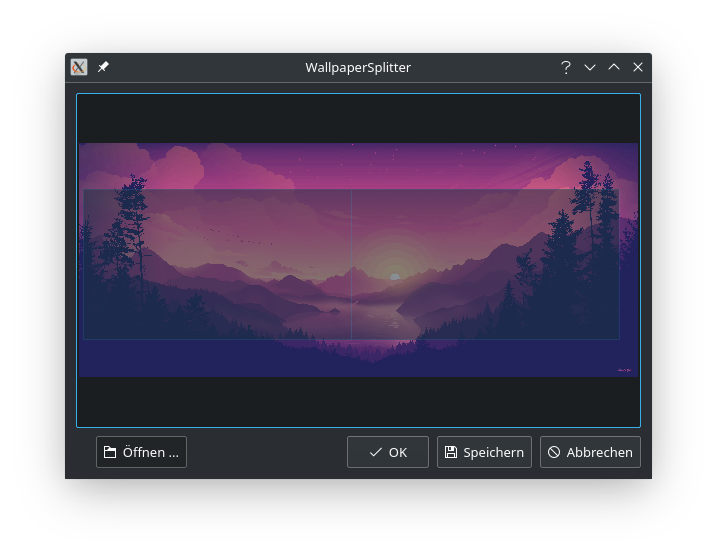

# Wallpaper Splitter

On KDE it is not possible to apply an image so that it spans across all of your screens.
This tool fixes that by splitting your image according to your screen setup.
It can also directly apply the image as your wallpaper.

Keep in mind that this only works with images, not with any fancy wallpaper engine or even dynamic wallpapers.

## 🚀 Features and roadmap

- [x] Split a given image
- [x] Apply the wallpaper from within the application
- [x] Adjust position
- [ ] Zooming into the scene and moving it around with the mouse wheel (scroll / click)
- [ ] Adjust scale (WIP)
- [ ] Add a command line tool so that no GUI is needed and the process can be automated by external scripts

## 💭 How to use it

1. Click the <kbd>📂 Open</kbd> button to open your image.
2. Adjust the position of your screens with <kbd>left-click</kbd> and the size with <kbd>right-click</kbd>.
   You can also zoom and move the scene around with your mouse wheel.
3. Save the images that will be your wallpaper by clicking <kbd>💾 Save</kbd> or
   apply them directly by clicking <kbd>✔️ Ok</kbd>.

Note that the buttons in the screenshot are labeled in german since that is my system language.

## ⚙️ How does it work

Opening and splitting the image is pretty straight forward.
Applying the image is done via a dbus call to the Plasmashell,
for more see the documentation provided [here](https://develop.kde.org/docs/plasma/scripting/api/).

## 💡 How to help

If you want to help out, create an issue or pull request and I will have a look at it.
If you are able to implement this directly into plasma, I would love to see that!
